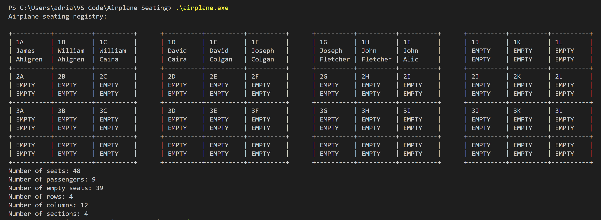

# Airplane-Seating-Registry
A warm-up exercise to get used to C++
<html>

- <b>nameGenerator.cpp</b> contains a function named <i>nameGenerator</i> that generates realistic names randomly from two arrays of first and last names.

- <b>airplane.cpp</b> contains a function named <i>Seating</i>.  

The user passes the desired number of rows, columns, and sections to the constructor of the Seating class during the creation of the registry object. The program will return a registry with random names assigned to the seats in the plane.

 

For 4 rows, 8 columns and 4 sections, the result should give an output similar to:
 
 

 
 
 
The prompted number of columns should be a multiple of the number of sections for best results.
  

<i>However, there are times when the program fails and returns a std::bad_alloc exception, which will be fixed soon.</i>
</html>
